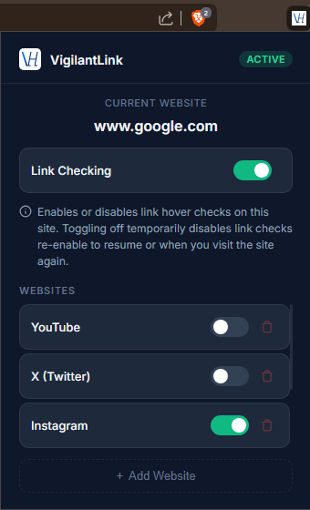

# VigilantLink

<p align="center" >Real-time, privacy-preserving phishing detection and deep link analysis for modern browsing.</p>

> This version (v2.0.0) is for local deployment and usage (No Minor or Patch Updates will be recived to this version only during Major Updates and Security Updates it will be updated) 
<p align="center">


</p>

<p align="center">
  
</p>

<p align="center">
  <strong>
    Detect phishing, malicious redirects, typosquatting, and suspicious websites before you click.
  </strong>
</p>

---

# Overview

VigilantLink is a browser extension designed to provide real-time phishing protection through progressive multi-phase security analysis.

Instead of relying on a single detection method, VigilantLink combines:

* Fast heuristic scanning
* Threat intelligence APIs
* Browser-based deep inspection
* Redirect analysis
* Domain reputation checks
* Multi-source risk scoring

The extension analyzes links directly on hover and provides instant security insights without interrupting the browsing experience.

---

# Features

* Real-time hover-based link analysis
* Google Safe Browsing integration
* Domain age intelligence (RDAP)
* Redirect chain analysis
* Multi-source heuristic scoring
* Typosquatting detection
* Playwright-powered deep scanning
* Progressive Phase 1 → Phase 2 architecture
* Privacy-focused logging and analysis
* Railway-ready production deployment
* Local standalone deployment support

---

# Documentation

Detailed technical documentation is available in the [docs/](docs/) directory:

*   [Architecture](docs/architecture.md) — System design and request lifecycle.
*   [Backend](docs/backend.md) — FastAPI structure and service modules.
*   [Extension](docs/extension.md) — Chrome MV3 architecture and messaging.
*   [Scoring Engine](docs/scoring-engine.md) — Risk methodology and signal weights.
*   [API Reference](docs/api-reference.md) — Endpoint schemas and JSON examples.
*   [Deployment](docs/deployment.md) — Railway, Docker, and production setup.
*   [Troubleshooting](docs/troubleshooting.md) — Common issues and recovery steps.

---

# Demo


## Safe Website Detection

<p align="center">
  
</p>

Fast real-time analysis of trusted domains using heuristic scanning, domain intelligence, and threat reputation checks.

---

## Malicious Website Detection

<p align="center">
  
</p>

Detection of phishing indicators, malicious redirects, and suspicious browser behavior using the progressive deep-scan engine.

Testing source (in Demo):

https://testsafebrowsing.appspot.com/

---

# Architecture

<p align="center">
  
</p>

### Architecture Overview

VigilantLink uses a progressive multi-phase security pipeline.

#### Phase 1 — Fast Heuristic Engine

* URL pattern analysis
* DNS & SSL validation
* Domain age intelligence
* Suspicious keyword detection
* Threat intelligence aggregation

#### Threat Intelligence Sources

* Google Safe Browsing
* PhishTank & OpenPhish
* Cloudflare Radar
* RDAP Domain Intelligence

#### Phase 2 — Deep Scan Sandbox

When a URL appears suspicious:

* Playwright launches a browser sandbox
* Redirect chains are analyzed
* Dynamic page behavior is inspected
* DOM phishing indicators are evaluated
* Final risk scoring is generated

#### Final Verdict Engine

The system aggregates all security signals and produces one of:

* 🟢 Safe
* 🟡 Suspicious
* 🔴 Dangerous

---

# How It Works

## Phase 1 — Fast Analysis

When the user hovers over a link:

* URL structure is analyzed
* DNS and SSL checks are performed
* Threat intelligence lookups begin
* Domain intelligence is collected
* Initial risk scoring is generated

This phase is optimized for low latency and responsiveness.

---

## Phase 2 — Deep Scan

If the URL appears suspicious or uncertain:

* A Playwright sandbox launches
* Redirect chains are inspected
* Dynamic content is analyzed
* DOM phishing indicators are evaluated
* Final risk scoring is updated

The extension polls asynchronously until the deep scan completes.

---

# Screenshots

## Extension Options Popup

<p align="center">
  
</p>

---

## Safe Website Result

<p align="center">
  
</p>

---

## Dangerous Website Detection

<p align="center">
  
</p>

---

# Privacy

VigilantLink is designed with privacy and security as a core principle.

The extension:

* Does not store browsing history
* Does not collect credentials
* Does not sell user data
* Minimizes backend logging
* Truncates sensitive URLs in production logs
* Uses progressive scanning to reduce unnecessary requests

---

# Installation

## Backend Setup

```bash
git clone <repo-url>

cd backend

pip install -r requirements.txt

playwright install chromium

uvicorn app.main:app --host localhost --port 8000
```

Once running, the backend will be available at `http://localhost:8000`.

---

## Extension Setup

1. Open Chrome
2. Navigate to:

```text
chrome://extensions/
```

3. Enable Developer Mode
4. Click "Load unpacked"
5. Select the extension directory

> [!NOTE]
> By default, the extension points to the production backend. To use your local backend, update `BACKEND_URL` in `extension/scripts/background.js` to `http://localhost:8000`.

---

# Tech Stack

* FastAPI
* Playwright
* Railway
* Redis
* Chrome Extension APIs
* Google Safe Browsing
* PhishTank & OpenPhish
* RDAP Domain Intelligence
* Python AsyncIO

---

# Roadmap

* Firefox support
* Edge support
* ML-assisted phishing analysis
* Local-only scanning mode
* Threat history dashboard
* Enterprise policy controls
* Advanced analytics
* Chrome Store deployment
---

# Repository Structure

```text
backend/
docs/
extension/
assets/
```

---

# License

MIT License

---

# Disclaimer

VigilantLink is a security assistance tool and should not be considered a guaranteed replacement for enterprise-grade endpoint protection or safe browsing practices.

Always verify sensitive websites manually when possible.
