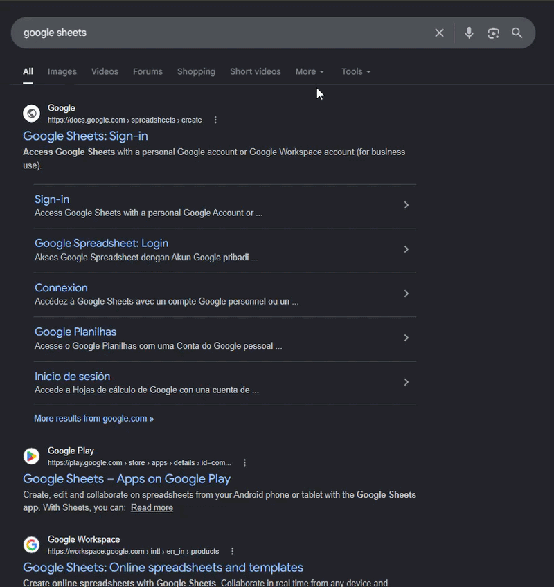
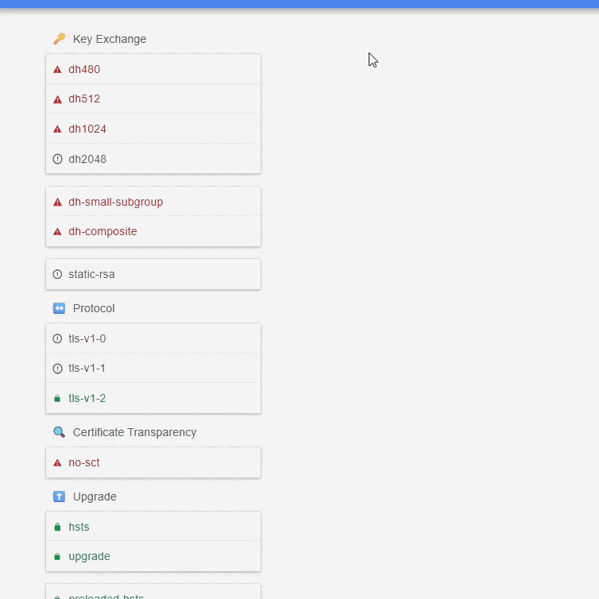
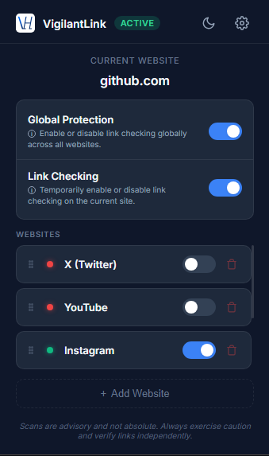
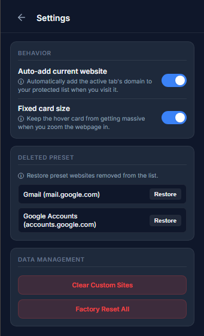
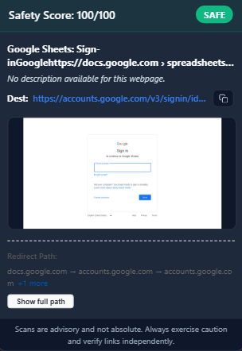
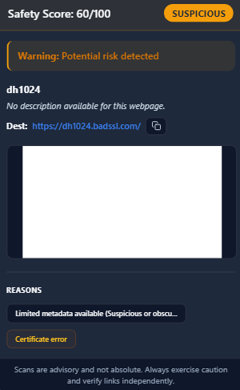
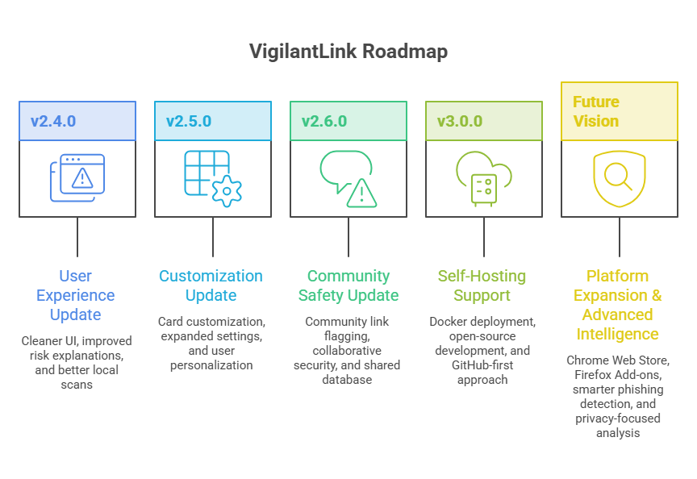

# VigilantLink

Real-time, privacy-preserving phishing detection and deep link analysis for modern browsing.

If this project helped you in any way consider starring the repo ⭐

  

  <strong>
    Detect phishing, malicious redirects, typosquatting, and suspicious websites before you click.
  </strong>

---

# Overview

VigilantLink is a browser extension designed to provide real-time phishing protection through progressive multi-phase security analysis.

Instead of relying on a single detection method, VigilantLink combines:

*   **Fast heuristic scanning**
*   **Threat intelligence APIs** (Google Safe Browsing, PhishTank, OpenPhish)
*   **Browser-based deep inspection** (Playwright)
*   **Redirect chain analysis**
*   **Domain reputation checks** (RDAP)
*   **Multi-source risk scoring**

The extension analyzes links directly on hover and provides instant security insights without interrupting the browsing experience.

---

# Features

*   **Real-time hover-based link analysis**
*   **Google Safe Browsing integration**
*   **Domain age intelligence (RDAP)**
*   **Redirect chain analysis**
*   **Multi-source heuristic scoring**
*   **Typosquatting detection**
*   **Playwright-powered deep scanning**
*   **Progressive Phase 1 → Phase 2 architecture**
*   **Privacy-focused logging and analysis**
*   **Render-ready production deployment**
*   **Local standalone deployment support**

---

# Documentation

Detailed technical documentation is available in the [docs/](docs/) directory:

*   [Architecture](docs/architecture.md) — System design and request lifecycle.
*   [Backend](docs/backend.md) — FastAPI structure and service modules.
*   [Extension](docs/extension.md) — Chrome MV3 architecture and messaging.
*   [Scoring Engine](docs/scoring-engine.md) — Risk methodology and signal weights.
*   [API Reference](docs/api-reference.md) — Endpoint schemas and JSON examples.
*   [Deployment](docs/deployment.md) — Render, Docker, and production setup.
*   [Troubleshooting](docs/troubleshooting.md) — Common issues and recovery steps.

---

# Demo

## Safe Website Detection

  

Fast real-time analysis of trusted domains using heuristic scanning, domain intelligence, and threat reputation checks.

---

## Malicious Website Detection

  

Detection of phishing indicators, malicious redirects, and suspicious browser behavior using the progressive deep-scan engine.

*Testing source (in Demo): [badssl.com](https://badssl.com/)*

---

# Architecture

  

### Architecture Overview

VigilantLink uses a progressive multi-phase security pipeline.

#### Phase 1 — Fast Heuristic Engine
*   URL pattern analysis
*   DNS & SSL validation
*   Domain age intelligence
*   Suspicious keyword detection
*   Threat intelligence aggregation

#### Phase 2 — Deep Scan Sandbox
When a URL appears suspicious:
*   Playwright launches a browser sandbox
*   Redirect chains are analyzed
*   Dynamic page behavior is inspected
*   DOM phishing indicators are evaluated
*   Final risk scoring is generated

#### Final Verdict Engine
The system aggregates all security signals and produces one of:
*   🟢 **Safe**
*   🟡 **Suspicious**
*   🔴 **Dangerous**

---

# Screenshots

## Extension Options Popup

  

---
## Extension Settings Popup

  

---

## Safe Website Result

  

---
## Dangerous Website Detection

  

---

# Installation

## Backend Setup (Render Deployment)

To deploy the backend to Render:
1. Create a new **Web Service** on Render and connect your GitHub repository.
2. Under **Build & Deploy**, set the **Root Directory** to `backend/`.
3. Set the **Runtime** to `Docker`.
4. Create a **Redis** service on Render (or use an external Redis provider) and copy its connection string.
5. In your Web Service settings, add the following environment variables:
   - `GOOGLE_SAFE_BROWSING_API_KEY`: Your Google Safe Browsing API key.
   - `REDIS_URL`: The connection string for your Redis instance.
   - `KEEP_ALIVE_URL`: The URL of your Render Web Service (e.g., `https://your-service-name.onrender.com`) to enable the self-ping keep-alive loop and prevent spin-downs.
6. Deploy the Web Service. Render will build and run the backend automatically using the provided `Dockerfile`.

*For local development setup instructions, please refer to [docs/deployment.md](docs/deployment.md).*

---

## Extension Setup

1. Open Chrome and navigate to `chrome://extensions/`.
2. Enable **Developer Mode** in the top-right corner.
3. Click **Load unpacked** and select the `extension/` directory of this repository.

> [!TIP]
> By default, the extension is configured to use the production Render backend (`https://vigilantlink-1.onrender.com`). If you want to connect it to your own deployed Render backend, update the `DEFAULT_BACKEND_URL` variable at the top of `extension/scripts/background.js` (and `popup.js`, `options.js` if necessary) to your service URL (e.g., `https://your-app-name.onrender.com`).

---

# Contributing

We welcome contributions! Please see our [CONTRIBUTING.md](CONTRIBUTING.md) for details on how to get started.

# Security

For reporting vulnerabilities, please refer to our [SECURITY.md](SECURITY.md).

# License

This project is licensed under the MIT License - see the [LICENSE](LICENSE) file for details.

# Road-Map

  

---

# Disclaimer

VigilantLink is a security assistance tool and should not be considered a guaranteed replacement for enterprise-grade endpoint protection or safe browsing practices. Always verify sensitive websites manually when possible.
